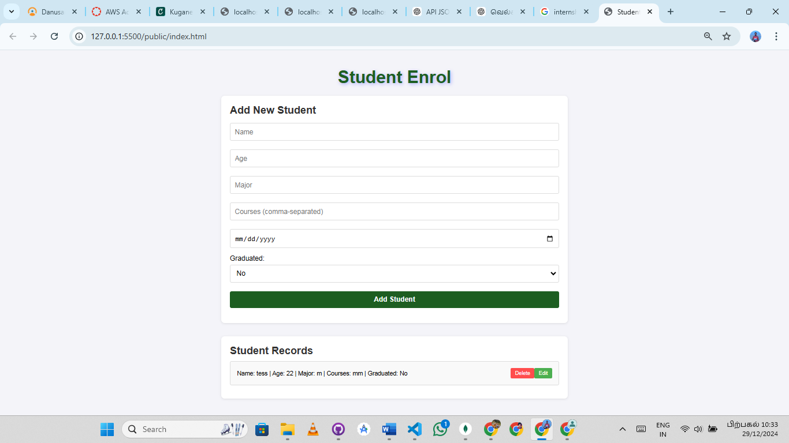
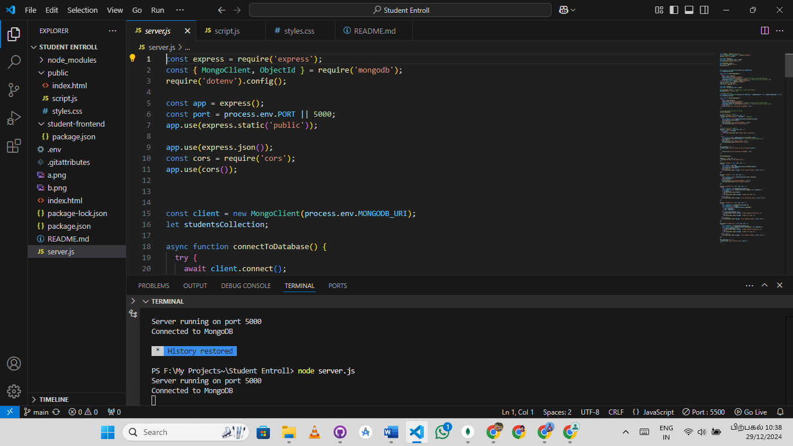
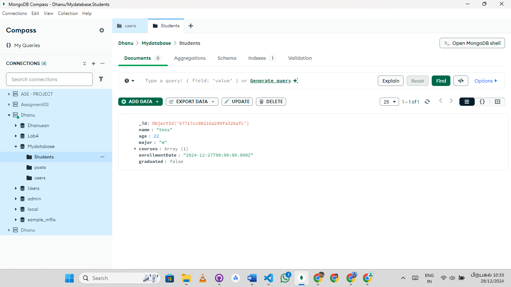

# Student Enrollment Management System

This is a Student Enrollment Management System developed for handling student enrollment and performing CRUD operations (Create, Read, Update, Delete) using HTML, CSS, JavaScript, Node.js, and MongoDB. The system allows users to manage student records easily with a simple and intuitive user interface.

## Features

- **Create**: Add new student records to the system.
- **Read**: View existing student records.
- **Update**: Modify student information.
- **Delete**: Remove student records from the system.
- **MongoDB Integration**: All student data is stored in a MongoDB database.
- **Responsive UI**: Built with HTML, CSS, and JavaScript for a user-friendly experience.

## Tech Stack

- **Frontend**: HTML, CSS, JavaScript
- **Backend**: Node.js
- **Database**: MongoDB
- **Libraries**: Express.js, Mongoose

## Snap Shots
   <h2>Screenshot of "Front End" </h2>
         <h2>Screenshot of "Back End" </h2>
         <h2>Screenshot of "Database" </h2>
        
        
Above is a screenshot of the 'Add Student' form in action.

## Prerequisites

Before running this project, make sure you have the following installed:

- [Node.js](https://nodejs.org/) (with npm)
- [MongoDB](https://www.mongodb.com/try/download/community) (or use MongoDB Atlas)

1. Clone the Repository
  First, clone this repository to your local machine:

    git clone https://github.com/yourusername/student-enrollment-management.git

3. Install Dependencies
  Navigate to the project directory and install the required dependencies:

   cd student-enrollment-management
   npm install

5. Set Up MongoDB
  Make sure MongoDB is installed and running on your machine. If you're using MongoDB Atlas, create a database cluster and obtain your connection string.
  Update the MongoDB connection string in config.js:

    const mongoose = require('mongoose');
    mongoose.connect('your-mongo-db-connection-string', {
      useNewUrlParser: true,
      useUnifiedTopology: true
    });

7. Run the Application
  After setting up the database connection, you can start the server:

   npm start
  The server will run on http://localhost:3000 by default. Open this URL in your web browser.

Usage
  Home Page: Displays all enrolled students.
  Add Student: Add a new student record by filling in the form.
  Edit Student: Edit the information of an existing student.
  Delete Student: Remove a student's record.
